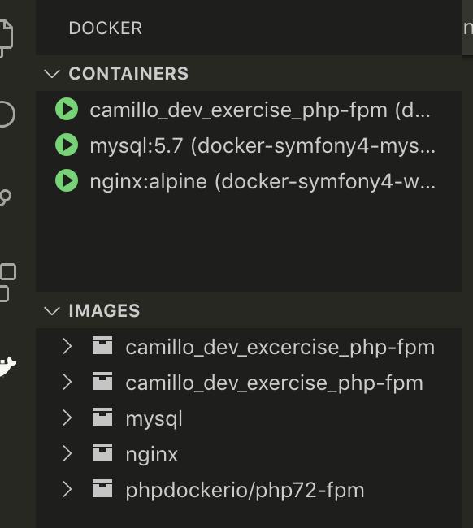
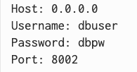
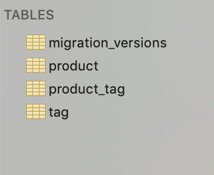
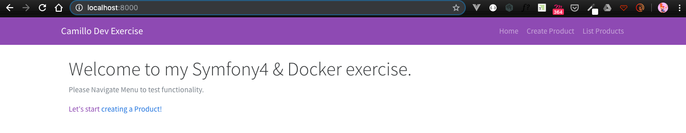

CRUD Symfony4 project in a Docker environment
==============================================

Hi, this is my simple CRUD appliaction using Symfony4 in Docker containers.  Please see below, steps and comments, achievements and difficulties.  

Let's start!  Go to your Terminal for some configuration steps:

- clone repository
`git clone https://github.com/cangelozzi/camillo_dev_exercise.git`

- navigate to project folder
`cd cangelozzi/camillo_dev_exercise`

- make sure to have Docker installed
`docker -v`

- now we need to download Docker images and start the containers!
`docker-compose up -d`

- once Docker images are ready, and containers are running, we should them with:
`docker image ls` (for images)
`docker ps` (for containers)

Docker structure should be:


Opening mySQL in the Terminal or in SequelPro, we need the below parameters:
```
Host: 0.0.0.0
Username: dbuser
Password: dbpw
Port: 8002
```


- and have already a database created:


=================================================================================
The beauty of Docker is that we can have the same type of environment in regards of any local setups; considering that Symfony4 needs a PHP7.2 and up (and perhaps we are still running in PHP5.6), we need to move inside the Docker PHP images to develp and create a complete Symfony project.  Let's do it! Back to the Terminal:
`docker-compose exec php-fpm bash`

Now you are a _root_ user, watch out! You have superpowers!

##### In the PHP Bash

- Let's bring all the goodies from Composer
`composer install`

- Almost there!  We need to create our DB/Tables structure
`bin/console doctrine:migrations:diff`
once done...
`bin/console doctrine:migrations:migrate`

- Looking at our Database / Tables, we should have something like:


- Let's go to the app, visit `http://localhost:8000/` 



=========================================================================================

# Development steps and comments

## 0. The solution must be based on Docker
A simple _compose file_ was created, bringing in `nginx:alpine` server, a `php-fpn`, and a `mysql:5.7`

## 1. "Create Product" page
The page responds to the route _/product/create_
As a site administrator I want to be able to insert a new type of product in a catalog.
:white_check_mark: - I want to define the name
:white_check_mark: - I want to be able to upload an image
:white_check_mark: - I want to be able to enter a description
:question: :question: - I want to be able to add one or more tags (at least one is mandatory) to the product

*Comments:*
Tags were the biggest challenge of the whole excersise.  My plan was to create a _Many-to-Many_ relationships between the Product and Tag entities, using _ArrayCollection_ to capture the tags in the products.  Apparently I missed some small points: the database and tables (including linking table) were populated correctly, however the tags were not bind the right way with products, and I carried this issue along the exercise.
Docs followed: https://symfony.com/doc/current/form/form_collections.html


## 2. "Products Listing" page
The listing page responds to the route _/product/list_
:white_check_mark: - As site administrator I want to see the catalog of all the products I have included in a list,
where I see the name and a reduced image preview, the products are sorted by creation
date.
:white_check_mark: - I see the creation date next to each product.
:question: :question: - I also want to be able to filter by the name of the associated tags.

*Comments:*
Again tags! :worried: Carrying the issue from the above point, I was not able to create any _Query Build_ based on tags.  Plan was to create queries in Doctrine Repositories.


## 3. "Product Edit" page
:x: The edit page responds to the route /product/{product}/edit
As a site administrator by clicking on the link of a row in the list or on the image, I want to go
to the form to modify the properties of the product.

*Comments:*
Of course, product and tags not having the right binding, when recalling the product for Editing I was getting an ugly `Binding entities to query parameters only allowed for entities that have an identifier.` error.  


=============================================================================================

# Overall Comments
Sadly the Tag / Product _Many-to-Many_ relationship issue created some cascade effect on the overall excercise; however, I am confidend that with some more debuging on the issue and some deep documentations review, the tags block could be solved, and consequently the rest of issue (sorting and edit page).  
With some investigation, I believe that the issue is coming from the Form in the Controller since the database tables (and linking table) are populated the correct way.
Finally, I trully enjoyed putting my hand on Symfony4 and see the differences and similarities with Laravel framework (which I have mainly used in PHP based project).  Lots of learning which I am always glad!  Some extra that I felt I wanted to add
- Flash messages
- Delete Route, using Fetch API

=============================================================================================

## Tools used during development phase:
- Docker
- Symfony4
- Doctrine2
- Bootstrap
- Javascript Fetch API, to get data from backend database


### Giving credits for places that helped to do this project

- https://stackoverflow.com/
- https://www.doctrine-project.org/projects/doctrine-orm/en/2.6/index.html
- https://twig.symfony.com/
- https://south634.com/


### Future Improvements
- :smile: ...for sure the _Many-to-Many_ relationship handle Product/Tag.
- Testing, testing testing...image validation, form validation.
- Using a different template engine in place of Twig (ie. VueJS, ReatJS).